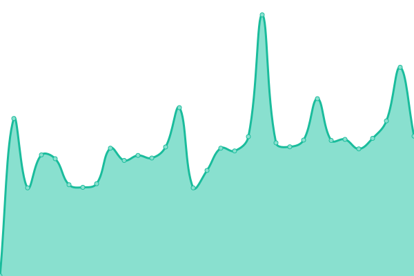
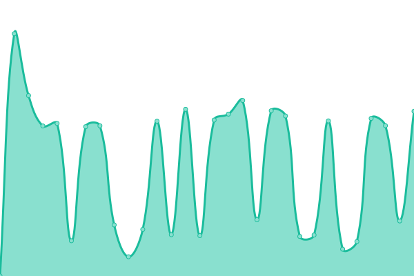

#  [LezWatch.TV](https://lezwatchtv.com)

This repository contains the open-source uptime monitor and status page for [LezWatch.TV (and related repositories)](https://lezwatchtv.com), powered by [Upptime](https://github.com/upptime/upptime).

<!--start: status pages-->
<!-- This summary is generated by Upptime (https://github.com/upptime/upptime) -->
<!-- Do not edit this manually, your changes will be overwritten -->
<!-- prettier-ignore -->
| URL | Status | History | Response Time | Uptime |
| --- | ------ | ------- | ------------- | ------ |
|  [LezWatch.TV](https://lezwatchtv.com) | 🟩 Up | [lez-watch-tv.yml](https://github.com/LezWatch/upptime/commits/HEAD/history/lez-watch-tv.yml) | 

 347ms
     
 | 

<a href="https://status.lezwatchtv.com/history/lez-watch-tv">98.82%</a>
    

|  [Documentation](https://docs.lezwatchtv.com) | 🟩 Up | [documentation.yml](https://github.com/LezWatch/upptime/commits/HEAD/history/documentation.yml) | 

 1954ms
     
 | 

<a href="https://status.lezwatchtv.com/history/documentation">100.00%</a>
    

|  [Last Death](https://lezwatchtv.com/wp-json/lwtv/v1/last-death?nocache) | 🟩 Up | [last-death.yml](https://github.com/LezWatch/upptime/commits/HEAD/history/last-death.yml) | 

 520ms
     
 | 

<a href="https://status.lezwatchtv.com/history/last-death">100.00%</a>
    

|  [GTMetrix](https://gtmetrix.com/api/2.0/reports/pRxVXw90) | 🟥 Down | [gt-metrix.yml](https://github.com/LezWatch/upptime/commits/HEAD/history/gt-metrix.yml) | 

 302ms
     
 | 

<a href="https://status.lezwatchtv.com/history/gt-metrix">0.00%</a>
    

|  [TVMaze](https://api.tvmaze.com/v1/auth/validate) | 🟩 Up | [tv-maze.yml](https://github.com/LezWatch/upptime/commits/HEAD/history/tv-maze.yml) | 

 372ms
     
 | 

<a href="https://status.lezwatchtv.com/history/tv-maze">100.00%</a>
    

|  [TMDB](https://api.themoviedb.org/3/authentication) | 🟩 Up | [tmdb.yml](https://github.com/LezWatch/upptime/commits/HEAD/history/tmdb.yml) | 

 178ms
     
 | 

<a href="https://status.lezwatchtv.com/history/tmdb">100.00%</a>
    

<!--end: status pages-->

[**Visit our status website →**](https://lezwatch.github.io/upptime)

## 📄 License

- Powered by: [Upptime](https://github.com/upptime/upptime)
- Code: [MIT](./LICENSE) © [Anand Chowdhary](https://anandchowdhary.com), supported by [Pabio](https://pabio.com)
- Data in the `./history` directory: [Open Database License](https://opendatacommons.org/licenses/odbl/1-0/)
